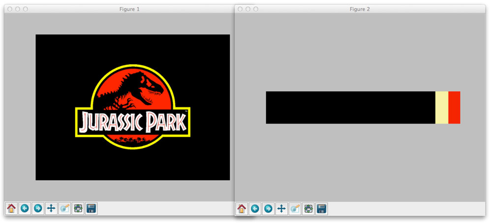

K-Means颜色聚类

什么是K-Means聚类

目标是将n个数据点划分为k个簇。n个数据点中的每个都会被分配到与某个簇的均值最接近的簇。每个簇的平均值称为“质心”或“中心”。

总的来说，应用K-Means可以得到由n个数据点组成k个独立的簇。与其他簇内的数据点相比，数据点在同一个簇内的可以认为是更相似。

在我们的例子中，我们会对RGB图片的像素亮度值进行聚类。对于M×N大小的图片，我们有M×N个像素点，每个像素点包含三个通道：红色（Red）、绿色（Green）和蓝色（Blue）。

我们将M×N这些像素点作为数据点并对它们使用K-Means进行聚类。

同一个给定簇之间的像素点在颜色的相似性会高于其他的独立簇。

K-Means的注意点是，我们需要指定簇的数量。有一些算法可以自动选择k的最佳值，但是这些算法不在本文的讨论范围之内。

好了，现在让我们用OpenCV、python和K-Means实现像素亮度值的聚类。

```
# 导入必要的包
from sklearn.cluster import KMeans
import matplotlib.pyplot as plt
import argparse
import utils
import pylab
import cv2

# 构造解析参数并分析这些参数
ap = argparse.ArgumentParser()
ap.add_argument("-i", "--image", required = True, help = "Path to the image")
ap.add_argument("-c", "--cluster", required = True , type = int,
                help = "# 簇数")
args = vars(ap.parse_args())

# 导入图片并将其从BGR转为RGB
#　这样子我们可以用matplotlib显示
image = cv2.imread(args["image"])
image = cv2.cvtColor(image, cv2.COLOR_BGR2RGB)

# 显示我们的图片
plt.figure()
plt.axis("off")
plt.imshow(image)
pylab.show() # 需要使用pylab，plt中的imshow才能在终端中正常显示图片
```


Line 2-7：导入我们需要的包。我们使用scikit-learn能更轻松地实现K-Means——无需重新造轮子。我们将使用matplotlib来显示我们的图片和主要的颜色。为了解析命令行参数，我们使用argparse，所使用的包包含两个帮助函数，稍后讨论。最后，cv2包包含了我们对OpenCV库的python绑定。

Line 10-14：解析我们的命令行参数。我们只要两个参数：--image，是我们图片在磁盘的存储路径，--clusters，我们计划产生的簇的数量。

Line 18-19：我们从磁盘中导入图片并将它从BGR转为RGB颜色空间。记住，OpenCV是以多维NumPy数组形式表示图片。然而，这些图片是有BGR顺序存储而不是RGB。为了解决这个问题，我们只需使用cv2.cvtColor函数。

最后，我们在Line22-25使用matplotlib在屏幕上显示图片。

在本文的上面提到过，我们的目标是从n个数据点中产生k个簇。我们将这M×N大小的图片视作为数据点。

为了达到上面的目的，我们需要将我们的图片变成一个像素列表，而不是M×N的像素矩阵。

```
# 将图片变成一个像素列表
image = image.reshape((image.shape[0]*image.shape[1], 3))
```

这段代码应该很容易解释。我们只是将我们的numpy数组重组为一个RGB像素列表。

现在已经准备好了数据点，我们可以使用K-Means来查找图片中最主要的颜色。

```python
# 像素点亮度值聚类
clt = KMeans(n_clusters = args["cluster"])
clt.fit(image)
```

我们使用scikit-learn中的k-means避免重新实现算法。

上面两行Line2实例化kmeans，提供希望生成的簇数量。Line3调用fit（）方法将像素列表聚类。

scikit-learn已经帮我们搞好其他事情了。

然而，为了显示图片中最主要的颜色，我们需要定义两个帮助函数。

新建一个文件，utils.py，并定义质心直方图函数。

```python
#　导入必要的包
import numpy as np
import cv2

def centroid_histogram(clt):
    # 获取不同簇的数量
    # 基于每个簇的像素点数量产生直方图
    numLabels = np.arange(0,len(np.unique(clt.labels_))+1)
    (hist, _) = np.histogram(clt.labels_, bins = numLabels)
    
    # 归一化直方图
    hist = hist.astype("float")
    hist /= hist.sum()
    
    # 返回直方图
    return hist
```

如我们所看到的，这个方法需要一个参数，clt。这是我们创建的color_kmeans.py中的k-means聚类对象。

在图像中，k-means算法将每个像素点分配给最近的簇。我们在Line8获取簇的数量，然后在Line9创建一个直方图包含每个簇中的像素数量。

最后，将直方图归一化，即所有之和为1，并在Line12-16中返回给调用者。

实际上，所有这些函数都是在计算属于各个簇的像素数量。

现在写我们的第二个帮助函数，plot_colors:

```python
def plot_colors(hist, centroids):
    # 初始化每种颜色相对频率的条形图
    bar = np.zeros((50, 300, 3), dtype = "uint8")
    startX = 0
    
    # 遍历每个簇的百分比和颜色
    for (percent, color) in zip(hist, centroids):
        # 画出每个簇的相对百分比
        endX = startX + (percent * 300)
        cv2.rectangle(bar, (int(startX), 0), (int(endX), 50), 
                     color.astype("uint8").tolist(), -1)
        startX = endX
        
	# 返回条形图
    return bar
```

plot_colors函数需要两个参数：hist，从centroid_histogram函数产生的直方图，centroids，由k-means算法产生的一系列质心（簇中心）。

Line3我们定义了一个300×50像素点矩形来保存图片中最主要的颜色。

Line7我们开始遍历颜色和百分比分布，然后在Line10行绘制当前颜色在图片中分布的百分比。Line15将颜色百分比条返回给调用者。

同样，这个函数执行了一个简单的任务——产生一个图形，显示基于centroid_histogram函数输出的每个簇中包含了多少个像素点。

现在，我们定义了两个帮助函数，我们可以将所有内容融合在一起。

以下为color_kmeans.py中的代码：

```python
#　创建一个簇的直方图
#  创建一个用不同颜色代表像素点数量的图形
hist = utils.centroid_histogram(clt)
bar = utils.plot_colors(hist, clt.cluster_centers_)

# 显示我们的颜色棒
plt.figure()
plt.axis("off")
plt.imshow(bar)
plt.show()
```

Line3是我们计算每个簇所含的像素点的数量，Line4将像素数量分配给每个簇并进行可视化。

Line7-10为显示图形

执行我们的脚本，使用以下的命令行运行：

```
python3 color_kmeans.py --image images/jp.png --clusters 3
```



运行我们能看到产生了三个簇（因为我们命令行中指定了三个簇）。图片中最主要的簇是黑色，黄色和红色。

使用OpenCV，python和kmeans对图片中RGB像素点进行聚类找到最主要的颜色是非常简单的。Scikit-learn为我们考虑了所有事情。本文中的代码主要是融合所有这些内容。

总结

本文演示了如何使用OpenCV，python和Kmeans找到图片中的主要颜色

Kmeans是一种基于n个数据点产生k个簇的聚类算法。簇的数量k必须提取制定。虽然存在算法能找到最优的k值，但是这超出来本文的内容范围。

为了找到图片中最主要的颜色，我们将所有像素点视作为数据点，然后应用Kmeans对他们进行聚类。

我们使用scikit-learn中Kmeans避免重新实现这个算法。


