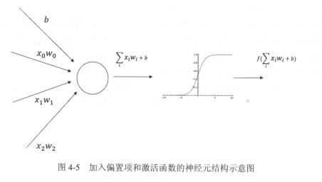
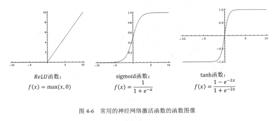
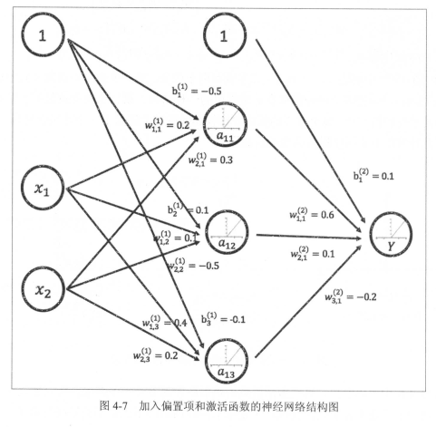

# 深度学习与深层神经网络

## 深度学习的概念

维基百科对深度学习的精确定义为“ 一类通过多层非线性变换对高复杂性数据建模算法的合集”。因为深层神经网络是实现“多层非线性变换”最常用的 一种方法，所以在实际中基本上可以认为深度学习就是深层神经网络的代名词。从维基百科给出的定义可以看出,深度学习有两个非常重要的特性——**多层和非线性。**

## 线性模型的局限性

在线性模型中，模型的输出为输入的加权和。假设 一个模型的输出 y 和输入 X； 满足以下关系，那么这个模型就是一个线性模型。
$$
y=\sum_{i} w_ix_i+b
$$
其中wi, b 为模型的参数 。

线性模型的最大特点是任意线性模型的组合仍然还是线性模型 。

之前的前向传播神经网络有两层（不算输入层）但是它和单层的神经网络井没有区别 。以此类推，只通过线性变换，任意层的全连接神经网络和单层神经网络模型的表达能力没有任何区别,而且它们都是线性模型 。 然而线性模型能够解决的问题是有限的 ，这就是线性模型最大的局限性。

## 激活函数实现去线性化

如果将每一个神经元(也就是神经网络中的节点)的输出通过一个非线性函数,那么整个神 经网络的模型也就不再是线性的了。这个非线性函数就是激活函数。下图显示了加入激活函数和偏置项之后的神经元结构 。

上面的定义主要有两个改变。第 一个改变是新的公式中增加了偏置项( bias )，偏置项是神经网络中非常常用的 一种结构 。第二个改变就是每个节点的取值不再是单纯的加权和 。每个节点的输出在加权和的基础上还做了一个非线性变换 。

常见的激活函数：

从图 4-6 中可以看出,这些激活函数的函数图像都不是一条直线。所以通过这些激活函数，每 一个节点不再是线性变换，于是整个神经网络模型也就不再是线性的了。

### 多层网络解决异或运算

在神经网络的发展史上，一个很重要的问题就是异或问题。

具体的可以找其他更多资料

